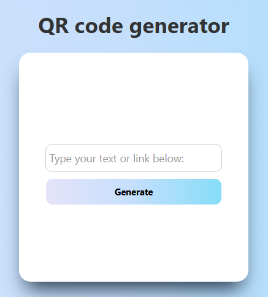

# QR Code Generator

This is a simple QR code generator built using PHP. The program allows users to input a website link and generates a QR code image for that link.

## Libraries Used

The program utilizes the following libraries:

1. **Endroid QR Code**: A library for generating QR codes in PHP.
   - Repository: [Endroid QR Code](https://github.com/endroid/qr-code)

2. **BaconQrCode**: A library that handles the underlying QR code generation logic used by Endroid QR Code.
   - Repository: [BaconQrCode](https://github.com/Bacon/BaconQrCode)

3. **DASPRiD Enum**: A library that provides an implementation of enumerations for PHP, used as a dependency by BaconQrCode.
   - Repository: [DASPRiD Enum](https://github.com/DASPRiD/Enum)

## Requirements

To run this program, ensure the following:

- PHP installed on your server (version 7.2 or higher recommended).
- The GD extension enabled in your PHP configuration for image creation.

## Installation Instructions

1. **Clone the repository** (or download the code).
2. **Install dependencies**:
   - If using Composer:
     ```bash
     composer require endroid/qr-code
     ```
   - Alternatively, download the required libraries manually and place them in the project directory.

3. **Update the autoloader**: Ensure your `index.php` includes the correct autoloading setup for the libraries.

## PHP Configuration

To ensure the program works correctly, you need to enable the GD extension in your `php.ini` file:

1. Open your `php.ini` file. This file is usually located in your PHP installation directory or XAMPP installation folder.
2. Search for the line:
   ```ini
   ;extension=gd

## Screenshots

Below are example screenshots demonstrating how the website works:

1. **QR Code Generation Form**:  
   

2. **Generated QR Code**:  
   